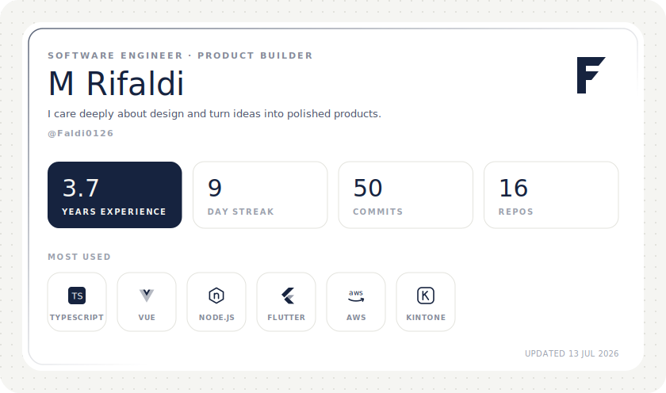

 

**[Personal Website](https://faldi.work)** &nbsp;·&nbsp; [LinkedIn](https://linkedin.com/in/faldi0126/) &nbsp;·&nbsp; [Instagram](https://instagram.com/faldi0126) &nbsp;·&nbsp; [Email](mailto:muhrifaldi26@gmail.com)

 

## About

I'm a Software Engineer and Product Builder who cares deeply about design and
loves turning ideas into real, polished products. I work across the whole arc of
a product, from the first sketch in Figma through to the code that ships.

 

## What I'm building
<table>
<tr>
<td width="50%" valign="top">

### Arbor

**Daily Affirmation Cards with Nature Artwork**

An iOS and Android app that promotes mental well-being through daily
nature-themed affirmations, philosophy, and guided meditations.

`Flutter` `Firebase` `Figma`

> In development

</td>
<td width="50%" valign="top">

### Stoku

**Supplies Tracker Tracker**

An iOS and Android app that helps users track their household supplies and
manage their inventory.

`Flutter` `SQLite` `Claude AI`

> In development

</td>
</tr>
</table>

 

## Experience

| Period | Role | Company |
| :--- | :--- | :--- |
| 2026 to present | Senior JavaScript Developer | AsiaQuest Indonesia |
| 2023 to 2026 | Middle JavaScript Developer | AsiaQuest Indonesia |
| 2022 to 2023 | Android Developer, Flutter | Qios Teknologi Indonesia |
| 2016 to 2021 | Independent Contractor | Freelance |

 

## Toolkit

**Engineering**
`Flutter` `React` `Vue` `Next.js` `Node.js` `TypeScript` `Firebase` `Supabase` `AWS` `Kintone`

**Design**
`Figma` `UI Design` `UX Research` `Prototyping` `Design Systems`

**Product**
`Strategy` `Ideation` `Roadmapping` `Market Research`

 

<!--
  Edit your name and tagline in .github/workflows/profile-card.yml,
  not here. The card image itself is written to dist/profile-card.svg.
-->
